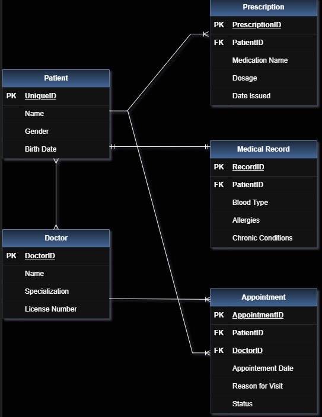

# 🏥    Med-Core: Laravel Middleware + CRUD Integration

## 📌 Project  Overview


This project is a functional Laravel application developed for the Middleware + CRUD Integration activity. It builds upon the previously designed Eloquent Relationships (Activity 2), transforming the ERD into a working system with a User Interface, full CRUD operations, and Role-Based Access Control (RBAC).

---
## 🛠️ Key Features

- Full CRUD Operations: Implementation of Create, Read, Update, and Delete functionality for Customers (Patients), Products (Medical Records), and Orders (Appointments).
- Eloquent Relationships & Eager Loading: Utilizes with() to load related data efficiently, minimizing database queries (N+1 problem prevention).
- Access Rules (Middleware):
    -Authenticated Only: Only logged-in users can access the system.

    - Entity Ownership: Regular users can only see and manage entities they have created.

    - Admin Privileges: Only users with the admin role can see all records and perform restricted actions (Edit/Delete).

    - Dynamic UI: Action buttons (Edit/Delete) are hidden or shown dynamically based on the user's role and permissions.


---

## 🧩 Database Relationships Overview

| Relationship Type | Entities | Logic (Business Rule) | Laravel Method |
|------------------|----------|-----------------------|----------------|
| One-to-One (1:1) | Patient ↔ MedicalRecord | A patient has exactly one medical record, and each medical record belongs to one patient. | hasOne() / belongsTo() |
| One-to-Many (1:N) | Patient → Prescription | A patient can have multiple prescriptions, but each prescription belongs to one patient. | hasMany() / belongsTo() |
| One-to-Many (1:N) | Patient → Appointment | A patient can have multiple appointments. | hasMany() / belongsTo() |
| One-to-Many (1:N) | Doctor → Appointment | A doctor can handle multiple appointments. | hasMany() / belongsTo() |
| Many-to-Many (N:M) | Patient ↔ Doctor (via Appointment) | Patients can consult multiple doctors, and doctors can have many patients through appointments. | belongsToMany() |

---

## 🧠 Business Logic Summary

- Each **Patient** has one **Medical Record**
- Each **Patient** can receive multiple **Prescriptions**
- Each **Patient** can book multiple **Appointments**
- Each **Doctor** can have multiple **Appointments**
- **Patient and Doctor** relationship is many-to-many via **Appointment (pivot table)**

---

## 🗂️ Database Tables

### 🧑 Patients
| Field | Type | Description |
|------|------|------------|
| id | bigint | Primary Key |
| name | string | Patient name |
| gender | string | Gender |
| birth_date | date | Birth date |

---

### 📄 Medical Records
| Field | Type | Description |
|------|------|------------|
| id | bigint | Primary Key |
| patient_id | bigint | Foreign Key (Patients) |
| blood_type | string | Blood type |
| allergies | text | Allergies |
| chronic_conditions | text | Chronic illnesses |

---

### 💊 Prescriptions
| Field | Type | Description |
|------|------|------------|
| id | bigint | Primary Key |
| patient_id | bigint | Foreign Key (Patients) |
| medication_name | string | Medicine name |
| dosage | string | Dosage |
| date_issued | date | Date issued |

---

### 👨‍⚕️ Doctors
| Field | Type | Description |
|------|------|------------|
| id | bigint | Primary Key |
| name | string | Doctor name |
| specialization | string | Field of expertise |
| license_number | string | License number |

---

### 📅 Appointments
| Field | Type | Description |
|------|------|------------|
| id | bigint | Primary Key |
| patient_id | bigint | Foreign Key (Patients) |
| doctor_id | bigint | Foreign Key (Doctors) |
| appointment_date | date | Appointment date |
| reason_for_visit | string | Reason |
| status | string | Status |

---

## 🔗 Eloquent Relationships

### Patient Model
- hasOne(MedicalRecord)
- hasMany(Prescription)
- hasMany(Appointment)
- belongsToMany(Doctor)

### Doctor Model
- hasMany(Appointment)
- belongsToMany(Patient)

### Appointment Model
- belongsTo(Patient)
- belongsTo(Doctor)

---

## ⚙️ Tech Stack & Implementation

- **Framework:** Laravel 13 (Laravel Installer 5.x)
- **Language:** PHP 8.x
- **Database:** MySQL / SQLite
- **ORM:** Eloquent ORM

---

## 🚀 How to Run the Project

```bash
composer install
cp .env.example .env
php artisan key:generate
php artisan migrate
php artisan serve